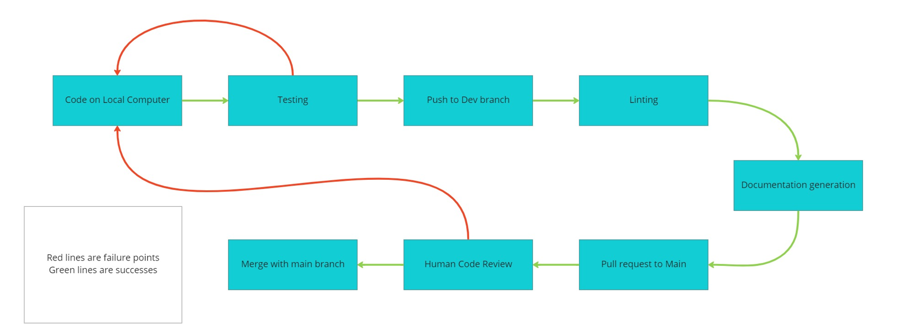

CI Pipeline Phase 1 plan

# In progress

## Linting:
The first step of the pipeline is simple linting.
We use HTMLHint to lint the html files.
StyleLint is used to lint and automatically fix css files.
We use semistandard to automatically fix the javascript files.
All of these are functional currently, and occur whenever the dev branch is changed.
Future developments could involve the development of config files to control what exactly we wish for our code to look like.
This has been tabled for now as that is work that does not really affect the result of the project.

## Documentation:
This one is simple, we use JSDocs to go through all of the files in /source/javascript and output the resulting html files into the /docs/ folder.
Future developments could involve the use of templates to customize our documentation.

# Planned

## Testing
Testing using jest should be as simple as adding one line to just run all tests in the repo.
The problem is that it does not appear that any tests have been written, so as soon as those are figured out running tests should be easy.

## Human Code Review
Human code review is not mandated at this point, but is highly recommended for when code is pushed to the repo.
Again, the problem lies in the fact that the dev branch has not been updated in weeks, and there is no way to review code on people's local machines.

# Future phases

Going beyond what we have now, having the CD part of the pipeline to actually deploy changes to a website would be important, but for now we do not have any deployment so it is not a priority.