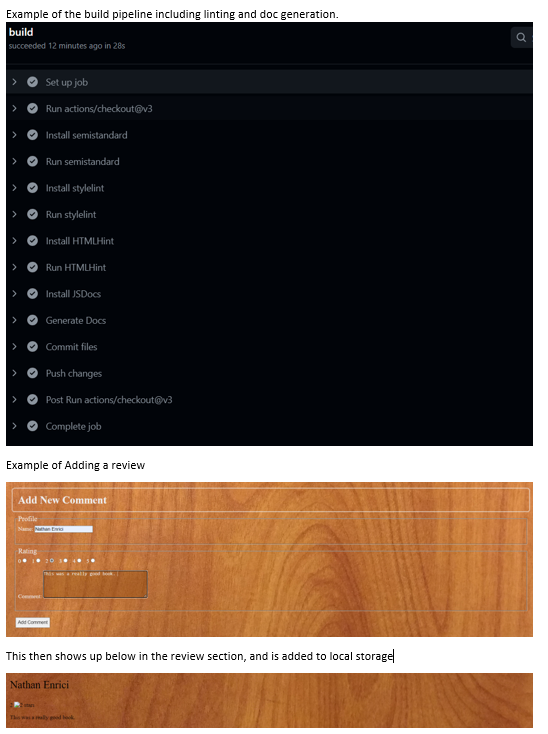
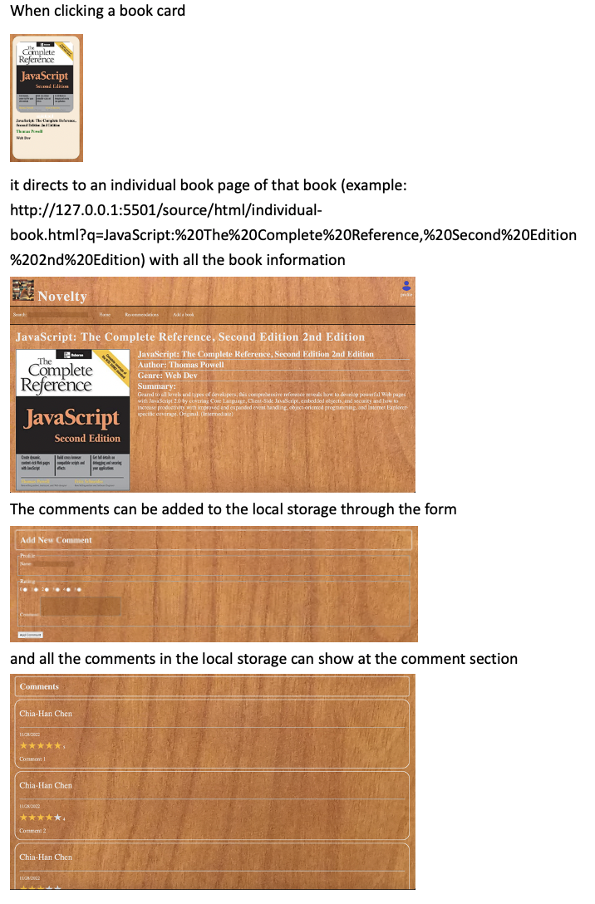

# Meeting Minutes
## Meeting Information
**Meeting Date/Time:** 11/28/22, 10 am  
**Meeting Purpose:** Go over what everybody accomplished during the last couple weeks
**Meeting Location:** Zoom
**Note Taker:** Nathan Enrici  

## Attendees
People who attended:
- Nathan Enrici
- Sarah Thomson
- Alexander Yang
- Nicholas Tran
- Averi Yu
- Chia-Han Chen
- Qiyun Li

## Agenda Items

Item | Description
---- | ----
Sprint Review | •Everybody shares what they did  •Upload demo information to the github

## Discussion Items
N/A

## Action Items
N/A

## Sprint Review

### Sarah Thomson
Fixed the css by making sure background works.  
Fixed book display on homepage.  
Worked on css for add a book page.  
Small css changes so site looks consistent.  

### Nathan Enrici
Worked on the pipeline.  
Worked with Chia-Han to add functionality to individual-book.html.  

### Alexander Yang
Added a writing tips page for reviews so that people can write better reviews.  

### Nicholas Tran
Trying to get search/genre bar to work.  
Connecting the elements from page query to work with local storage to filter books.  

### Averi Yu
Worked with php files and trying to make sql local first  

### Chia-Han Chen
Did HTML and CSS for individual-book page.  
Worked on javascript as well.  
Individual-book page exists for every book added and reviews can be added  

### Qiyun Li
Working on the search functionality.  

### Sam Ji (Did not attend but put information in slack)
I was able to implement Sorting functionality. Now users can sort books by:  
price low to high;  
price high to low:  
newest;  
popularity;  

## Meeting End Time
10:40 am
