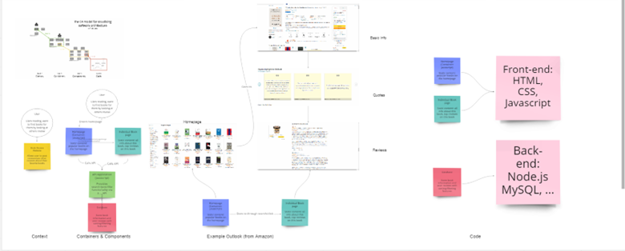
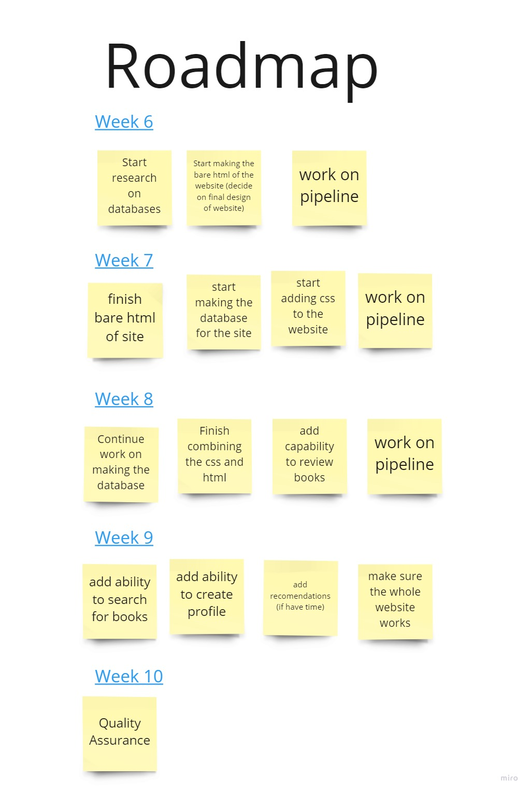

## Statement of Purpose

Giving people a way to review books and find new books to read

## Time Constraints

We have 4 or 5 weeks to get the project done with about 8 people. Due to this
we stingent on what features we are going to implement because we may not get everything
done. The main goal with this time constraint is starting with the most important things and
slowly working towards the smaller details as to not overwhelm us at the very beginning with
too much work.

## Risks and Rabbit Holes

- creating a database
  - limit our scope and slowly build it up
  - splitting up into teams so not everyone is stuck on it
- sorting and recommending books
- time period to do it
- making the css
  - having desing meetings as a group so eveyone agrees what it will look like
- convoluted code
  - comment your code
- navigation around the website
  - clear communication and planning
  - make a hierarchy of pages and start with the more important
- getting stuck on the small details
  - look at the big picture and slowly work on the smaller ones given time

## No-Gos

- Do not start with recommender system
  - prioritize the ability to review books before we touch this
- don't care about style in the beginning
  - prioritize functionality over looks

## User Persona - Book Lover

### Name:

Elizabeth

### Photo:

### Personal Moto:

There is no friend as loyal as a book

### Bio:

Grew up in a small town and always could be found with their head in a book.
Has their own personal library at home and is constantly trying to find their next great read.

### Demographics:

- Degree in literature
- 25 years old
- lives in a small town
- volunteers at the library
- goes to book conventions

### Personality Traits:

- homebody
- intreverted

### Motivations:

- want to find their next good read
- have a conversation about books
- find people that like the same things

### Goals and Frustrations:

- not tech savy
- review books
- get good recomendations

### User Stories
As a book lover, I want to find some good and interestnig books, so that I can have some joy in my free time. 

## User Persona

### Name: Learning Lenny

### Photo:

### Personal Motto:

E pluribus unum

### Bio:

Lenny is a student looking forwards to college or a career. He is currently at school, which is where he has done most of his reading over the last few years. He wants to make any assignments that require reading more fun by finding books that he enjoys. He is also interested in exploring potential careers by reading books about them. He is worried about the potential for these to go wrong and wants to know others have used these successfully.

### Demographics:

- Student
- Young adult

### Personality Traits:

- Studious
- Motivated
- Somewhat tech-savvy
- hard-working

### Motivations:

- Motivated to read primarily by the necessity of schoolwork.
- Remembers books that they have enjoyed in the past and wants to find similar books.
- Also wants to find books to improve, learn about potential interests.

### Goals and Frustrations:

- Wants to find books that are interesting to read for school projects.
- Wants to advance their education and career.
- Frustrated with the difficulty of finding good books with the giant selection available.

### User Stories
As a student in college, I want to find some good books to help me study, so that I can do better in classes. 

## System Diagram (Draft)

## Wire Frames

## Road Map

